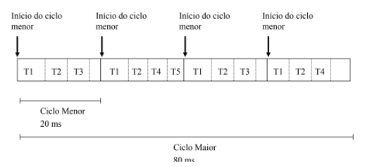

# Executivo Cíclico

## Objetivo

  Fazer a analise de um conjunto de tarefas (arquivo .json) para determinar se o sistema é escalonável ou não. Caso seja escalonável, mostrar a organização das tarefas no período maior;

  A organização dessas tarefas deve seguir uma heurística conhecida, foi utilizada a heurística Highest Rate First - HRF;

* Maior Taxa de Periodicidade Primeiro (Highest Rate First - HRF): Nesta abordagem, as tarefas são priorizadas com base na frequência de sua execução; tarefas que devem ser executadas mais frequentemente têm prioridade. Isso é baseado na lógica de que tarefas com períodos mais curtos são geralmente mais críticas e, portanto, devem ser atendidas com maior prioridade para evitar a violação de seus prazos.

## 🔧 Funcionalidades
### Cálculo dos tempos de ciclo

* Tempo de ciclo primário: calculado como o mínimo múltiplo comum (MMC) de todos os períodos das tarefas, representando o ciclo maior que sincroniza todas as tarefas em sua periodicidade.

* Tempo de ciclo secundário: determinado como o maior divisor comum (MDC) dos períodos das tarefas, representando o menor ciclo possível que ainda respeita as periodicidades das tarefas.

### Cálculo do escalonamento usando heurísticas

  A heurística considera os tempos de execução das tarefas, seus períodos e prioridades para organizar a sequência de execução dentro do ciclo.

## Formato de entrada

```
json
{
  "tarefas": [
    {
      "id": "Tarefa1",
      "periodo": 100,
      "tempo_execucao": 10,
      "prioridade": 1
    },
    {
      "id": "Tarefa2",
      "periodo": 200,
      "tempo_execucao": 20,
      "prioridade": 2
    },
    {
      "id": "Tarefa3",
      "periodo": 50,
      "tempo_execucao": 5,
      "prioridade": 3
    }
  ]
}
```

### Detalhes do formato de entrada

- id: identificador único para cada tarefa.
- periodo: o período de cada tarefa ou intervalo de tempo entre as execuções.
- tempo_execucao: o tempo necessário para completar a tarefa.
- prioridade: número que indica a prioridade da tarefa, sendo 1 a mais alta.


## 🧩 Construção

### Classe JsonManager
  Criação de uma classe, que recebesse o caminho para o arquivo json e que, posteriormente, conseguisse ler os itens separadamente, além de conseguir ter acesso a cada característica de cada item separadamente.

```
class JsonManager:

    def __init__(self):
        self.path = dirname(realpath(__file__)) + '/'

    
    def read_json(self, file):
        if isfile(self.path + file):
            with open(self.path + file) as f:
                data = load(f)
            return data
        else:
            return False
```

### Requisito principal

  Uma das necessidades para que o escalonamento seja possível é que a Taxa de Utilização (U) seja menor que 1, logo, caso U > 1, o Executivo é inviável.

$$
U = \sum_{i=0}^{\infty} \frac{e_i}{P_i} \leq 1
$$

Para isso, temos:

```
def taxa_ultiliza():

    data = jmanager.read_json('data/tarefas.json')
    range_tarefas = range(0, len(data))

    taxa_utilizacao = 0

    for i in range_tarefas:
        taxa_utilizacao += (data[i]['tempo_execut'])/(data[i]['periodo'])
    
    return taxa_utilizacao
```

Esse tipo de escalonamento implica na existência de dois “ciclos”, um menor, onde as tarefas são alocadas com prioridade no menor período, e, uma maior, que vai se repetir ao longo do tempo.



O cálculo do ciclo maior é mais simples, já que é apenas o Mínimo Múltiplo Comum (MMC) entre os períodos.

```
def calculo_MMC():
    data = jmanager.read_json('data/tarefas.json')
    range_tarefas = range(0, len(data))
    periodo = []

    for i in range_tarefas:
        periodo.append(int(data[i]['periodo']))

    # Calcular o MMC dos períodos
    result = periodo[0]
    for num in periodo[1:]:
        result = lcm(result, num)

    return result
```

### Requisitos secundários

O cálculo do ciclo menor tem alguns requisitos que devem ser cumpridos, porém uma boa estimativa é o Máximo Divisor Comum (MDC) entre os períodos das tarefas, porém isso não é suficiente para afirmar que será escalonável nesse tempo. Logo, é necessário testar alguns possíveis valores para o ciclo menor.

* Requisito #1:
O tamanho do frame deve ser maior ou igual ao maior tempo de execução de uma tarefa:

$$
f \geq \max(e_i)
$$


* Requisito #2:
O tamanho dos frames candidatos deve caber igualmente dentro de um ciclo maior.

* Requisito #3:
Deve existir um frame entre o release-time ((t’)) e o deadline ((t’ + D_l)) de todos os jobs:

$$
2f - \text{gcd}(p_i,f) \leq D_i, 
$$

Para descobrir os possíveis valores do ciclo menor é criado uma lista “f” que recebe os valores de “x” que satisfazem essas condições

```
   while(x != 0):

        if x > ciclo_maior:
            break

        for i in range_tarefas:
            if x > tempo_execut[i]:
                if (2*x - gcd(periodo[i],x) <= periodo[i] ):
                    if (ciclo_maior % x) == 0:
                        f.append(x)
            x += 1
```

## 👨‍💻 Desenvolvimento do algoritmo

Os valores salvos em “f” são testados logo após, para isso, é criada uma variável auxiliar que vai receber um valor da função “heurística”, ela tenta alocar as tarefas, com base na maior periodicidade primeiro, dentro do ciclo maior com esse possível valor “x” como ciclo menor
Nessa função, é feito um teste para saber se as tarefas realmente se repetiram a quantidade de vezes necessária, caso não, há um retorno False para variável auxiliar, caso contrário,  o valor do ciclo menor foi achado.

```
for i in range(len(f)):

        print(f'Testando:  {f[i]}', end='\n\n')
        aux = heuristica(ciclo_maior, f[i])[1]

        if aux != False:
            ciclo_menor_correto = f[i]
            break
        else:
            print(f'O valor {f[i]} é INVÁLIDO', end = '\n\n')
            ciclo_menor_correto = False
```
```
def heuristica(ciclo_maior, ciclo_menor):

    data = jmanager.read_json('data/tarefas.json')
    range_tarefas = range(0, len(data))

    prioridade = []
    tempo_execut = []

    periodo_ordenado = []
    periodo_modificado = []

    repeticoes = []
    for i in range_tarefas:
        prioridade.append(data[i]['tarefa'])
        tempo_execut.append(data[i]['tempo_execut'])
        periodo_ordenado.append(data[i]['periodo'])
        periodo_modificado.append(data[i]['periodo'])
        repeticoes.append(ciclo_maior/data[i]['periodo'])

    periodo_ordenado = selection_sort(periodo_ordenado, tempo_execut, periodo_modificado, prioridade, repeticoes)[0]
    tempo_execut = selection_sort(periodo_ordenado, tempo_execut, periodo_modificado, prioridade, repeticoes)[1]
    periodo_modificado = selection_sort(periodo_ordenado, tempo_execut, periodo_modificado, prioridade, repeticoes)[2]
    prioridade = selection_sort(periodo_ordenado, tempo_execut, periodo_modificado, prioridade, repeticoes)[3]
    repeticoes = selection_sort(periodo_ordenado, tempo_execut, periodo_modificado, prioridade, repeticoes)[4]
```

Ao utilizar a função “selection_sort”, essas listas são organizadas com base na prioridade estabelecida anteriormente em que o maior período tem a máxima prioridade.

```
def selection_sort(lista, lista_2, lista_3, lista_4, lista_5):
    n = len(lista)
    for i in range(n):
        min_idx = i
        for j in range(i+1, n):
            if lista[j] < lista[min_idx]:
                min_idx = j
        lista[i], lista[min_idx] = lista[min_idx], lista[i]
        lista_2[i], lista_2[min_idx] = lista_2[min_idx], lista_2[i]
        lista_3[i], lista_3[min_idx] = lista_3[min_idx], lista_3[i]
        lista_4[i], lista_4[min_idx] = lista_4[min_idx], lista_4[i]
        lista_5[i], lista_5[min_idx] = lista_5[min_idx], lista_5[i]
    
    return [lista, lista_2, lista_3, lista_4, lista_5]
```

No algoritmo, cada tarefa é avaliada em cada ciclo menor, usando um período modificado. Esse período é atualizado a cada iteração do ciclo maior, permitindo que tarefas com períodos mais longos sejam consideradas novamente nos ciclos menores.

```
ciclos = []
    qt_ciclos = ciclo_maior/ciclo_menor
    tempo = 0
    ciclo_atual = []
    for j in range(0, int(qt_ciclos)):
        for i in range_tarefas:
            if (tempo + tempo_execut[i]) <= ciclo_menor and len(ciclos) < qt_ciclos: 
                if periodo_modificado[i] >= periodo_ordenado[i]:
                    ciclo_atual.append(prioridade[i])
                    repeticoes[i] -= 1
                    tempo += tempo_execut[i]
                    periodo_modificado[i] = 0
            if periodo_modificado[i] < periodo_ordenado[i]:
                periodo_modificado[i] += ciclo_menor
```

 Além disso, o número de repetições de cada tarefa é atualizado a cada ciclo maior e verificado no final para determinar o sucesso do escalonamento.

```
 ciclos.append(ciclo_atual)  
 
        ciclo_atual = []
        tempo = 0

    aux = 0
    for i in repeticoes:
        if i != 0:
            aux += 1
    if aux != 0:
        return [False, False]

    return [prioridade, ciclos]
```

Agora, basicamente tem o início da chamada das funções, que é onde o programa começa sua compilação. Primeiramente, é mostrado a quantidade total de tarefas, depois é mostrado a taxa de utilização em porcentagem, e caso essa taxa seja maior que 1, o programa para, já que o sistema não é escalonável.

```
os.system('cls')
jmanager = JsonManager()

data = jmanager.read_json('data/tarefas.json')
json_size = len(data)
range_tarefas = range(0, len(data))
print(f'A quantidade de tarefas é: {json_size}')

taxa_utilizacao = taxa_ultiliza()
print(f'A taxa de utilização é {taxa_utilizacao*100}%',end = "\n\n")

if taxa_utilizacao > 1:
    print('Sistema impossível de ser escalonado')
    exit()
```

São inicializadas variáveis como ciclo menor, ciclo maior e uma lista "f" que será preenchida posteriormente. Além disso, o código preenche listas com os valores de período e tempo de execução vindos de um arquivo .json, caso a taxa de utilização seja inferior a 1, a compilação continua.
```
else:

    ciclo_maior = calculo_MMC()
    ciclo_menor = calculo_MDC()
 

    tempo_execut = []
    periodo = []

    f = []


    for i in range_tarefas:
        tempo_execut.append(data[i]['tempo_execut'])
        periodo.append(data[i]['periodo'])

    print('Testando possíveis valores de ciclo menor:', end='\n')
```

Logo após, esse trecho há o preenchimento da lista “f” com os valores possíveis para o ciclo menor:

```
x = 1

    while(x != 0):

        if x > ciclo_maior:
            break

        for i in range_tarefas:
            if x > tempo_execut[i]:
                if (2*x - gcd(periodo[i],x) <= periodo[i] ):
                    if (ciclo_maior % x) == 0:
                        f.append(x)
            x += 1
    
    print(f'{f} \n\n')
```

No próximo trecho, há os testes dos possíveis valores de “f”, faz-se isso com a chamada da função “heurística”, caso haja retorno False, então o valor de ciclo menor não satisfaz a heurística, caso seja diferente, então o valor é aceito.

```
   for i in range(len(f)):

        print(f'Testando:  {f[i]}', end='\n\n')
        aux = heuristica(ciclo_maior, f[i])[1]

        if aux != False:
            ciclo_menor_correto = f[i]
            break
        else:
            print(f'O valor {f[i]} é INVÁLIDO', end = '\n\n')
            ciclo_menor_correto = False
```

Caso nenhum valor seja aceito para o ciclo menor, então o conjunto de tarefas não é escalonável, então é dado um exit. Porém, se esse valor existir, o programa continua, é mostrado os valores dos ciclos, as tarefas com seus devidos períodos e tempos de execução, a ordem de prioridade e como cada ciclo menor foi organizado no ciclo maior.

```
if ciclo_menor_correto == False:
        print('Não ESCALONÁVEL')

        exit()

    ciclo_maior = calculo_MMC()
    print(f'O Ciclo Maior do Executivo Cíclico é: {ciclo_maior} unidades de tempo', end='\n')

    
    print(f'O Ciclo Menor do Executivo Cíclico é: {ciclo_menor_correto} unidades de tempo', end="\n\n")
```
```
for i in range_tarefas:
        print(f'{data[i]['tarefa']} tem o período: {data[i]['periodo']}')
    
    print('',end = '\n\n')

    for i in range_tarefas:
        print(f'{data[i]['tarefa']} tem tempo de execução: {data[i]['tempo_execut']}')
    
    print('',end = '\n\n')
    
    
  
    print('Heurística escolhida: HRF',end ='\n\n')

    prio = heuristica(ciclo_maior, ciclo_menor_correto)[0]
    ciclo = heuristica(ciclo_maior, ciclo_menor_correto)[1]

    print('As prioridades são: ',f'\n {prio} \n')

    print('Os ciclos menores são: ', end='\n\n')

    try:
        for i in range(0,len(ciclo)):
            print(f'CICLO {i+1}: ', end = '\n')
            print(f'\n {ciclo[i]} \n' )
    except:
        print(ciclo)
```

## 📊 Resultados
### Para o conjunto 1

 ```
A quantidade de tarefas é: 5
A taxa de utilização é 95.0%

Testando possíveis valores de ciclo menor:
[4, 5, 8, 10, 20, 40, 80]

Testando:  4
O valor 4 é INVÁLIDO

Testando:  5
O valor 5 é INVÁLIDO

Testando:  8
O valor 8 é INVÁLIDO

Testando:  10
O valor 10 é INVÁLIDO

Testando:  20
O Ciclo Maior do Executivo Cíclico é: 80 unidades de tempo
O Ciclo Menor do Executivo Cíclico é: 20 unidades de tempo

Tarefa 1 tem o período: 20
Tarefa 2 tem o período: 20
Tarefa 3 tem o período: 40
Tarefa 4 tem o período: 40
Tarefa 5 tem o período: 80

Tarefa 1 tem tempo de execução: 8
Tarefa 2 tem tempo de execução: 7
Tarefa 3 tem tempo de execução: 4
Tarefa 4 tem tempo de execução: 3
Tarefa 5 tem tempo de execução: 2

Heurística escolhida: HRF

As prioridades são:
 ['Tarefa 1', 'Tarefa 2', 'Tarefa 3', 'Tarefa 4', 'Tarefa 5']

Os ciclos menores são:

CICLO 1:
 ['Tarefa 1', 'Tarefa 2', 'Tarefa 3']

CICLO 2:
 ['Tarefa 1', 'Tarefa 2', 'Tarefa 4', 'Tarefa 5']

CICLO 3:
 ['Tarefa 1', 'Tarefa 2', 'Tarefa 3']

CICLO 4:
 ['Tarefa 1', 'Tarefa 2', 'Tarefa 4']
```

### Para o conjunto 2

```
Resultado 2:

A quantidade de tarefas é: 5
A taxa de utilização é 92.0%

Testando possíveis valores de ciclo menor:
[5, 10, 20, 25, 50, 100]

Testando:  5
O valor 5 é INVÁLIDO

Testando:  10
O valor 10 é INVÁLIDO

Testando:  20
O valor 20 é INVÁLIDO

Testando:  25
O Ciclo Maior do Executivo Cíclico é: 100 unidades de tempo
O Ciclo Menor do Executivo Cíclico é: 25 unidades de tempo

Tarefa 1 tem o período: 25
Tarefa 2 tem o período: 25
Tarefa 3 tem o período: 50
Tarefa 4 tem o período: 50
Tarefa 5 tem o período: 100

Tarefa 1 tem tempo de execução: 10
Tarefa 2 tem tempo de execução: 8
Tarefa 3 tem tempo de execução: 5
Tarefa 4 tem tempo de execução: 4
Tarefa 5 tem tempo de execução: 2

Heurística escolhida: HRF

As prioridades são:  
 ['Tarefa 1', 'Tarefa 2', 'Tarefa 3', 'Tarefa 4', 'Tarefa 5']

Os ciclos menores são:

CICLO 2:
 ['Tarefa 1', 'Tarefa 2', 'Tarefa 4']

CICLO 3:
 ['Tarefa 1', 'Tarefa 2', 'Tarefa 3']

CICLO 4:
 ['Tarefa 1', 'Tarefa 2', 'Tarefa 4']

```

### Conjunto 3

```
Resultado 3: 

A quantidade de tarefas é: 3   
A taxa de utilização é 55.00000000000001%

Testando possíveis valores de ciclo menor:
[4, 5, 10]

Testando:  4
O Ciclo Maior do Executivo Cíclico é: 20 unidades de tempo    
O Ciclo Menor do Executivo Cíclico é: 4 unidades de tempo     

Tarefa 1 tem o período: 10     
Tarefa 2 tem o período: 10     
Tarefa 3 tem o período: 20     

Tarefa 1 tem tempo de execução: 2
Tarefa 2 tem tempo de execução: 3
Tarefa 3 tem tempo de execução: 1

Heurística escolhida: HRF      

As prioridades são:
 ['Tarefa 1', 'Tarefa 2', 'Tarefa 3']

Os ciclos menores são:

CICLO 1:
 ['Tarefa 1', 'Tarefa 3']      

CICLO 2:
 ['Tarefa 2']

CICLO 3:
 []

CICLO 4:
 ['Tarefa 1']

CICLO 5:
 ['Tarefa 2']

```


### Conjunto 4 - Caso de ERRO

```
Resultado 4:

A quantidade de tarefas é: 4
A taxa de utilização é 100.0%

Testando possíveis valores de ciclo menor:
[8, 12, 16, 24, 48]

Testando:  8
O valor 8 é INVÁLIDO

Testando:  12
O valor 12 é INVÁLIDO

Testando:  16
O valor 16 é INVÁLIDO

Testando:  24
O valor 24 é INVÁLIDO

Testando:  48
O valor 48 é INVÁLIDO

```

## 📺Vídeo de Demonstração

[](https://youtu.be/mE8hrT-NejE)

## 👍 Conclusão

Desenvolver um executivo cíclico que analise um conjunto de tarefas em um arquivo .json para determinar a escalabilidade do sistema é um passo fundamental na gestão eficiente de recursos computacionais. Ao aplicar uma heurística como a Highest Rate First (HRF), podemos priorizar tarefas com taxas de utilização mais altas, o que pode levar a um melhor aproveitamento dos recursos e a um escalonamento mais eficaz.

## ✒️ Colaboradores
* **Bruno Nascimento de Oliveira** - [BRUNONASCIOLI](https://github.com/BRUNONASCIOLI)
* **José Tayrone Santos de Oliveira** - [thayroneo](https://github.com/thayroneo)
* **Yuri Siqueira Dantas** - [YuriDants](https://github.com/YuriDants)

Você também pode ver a lista de todos os [colaboradores](https://github.com/BRUNONASCIOLI/Projeto_STR/colaboradores) que participaram deste projeto.
